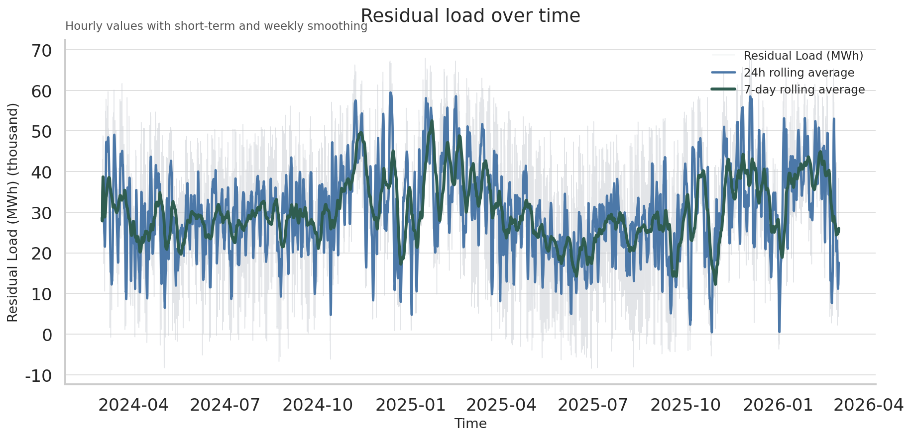
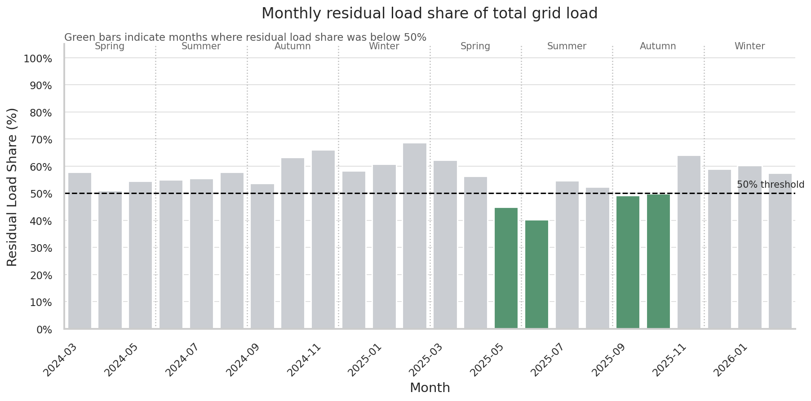
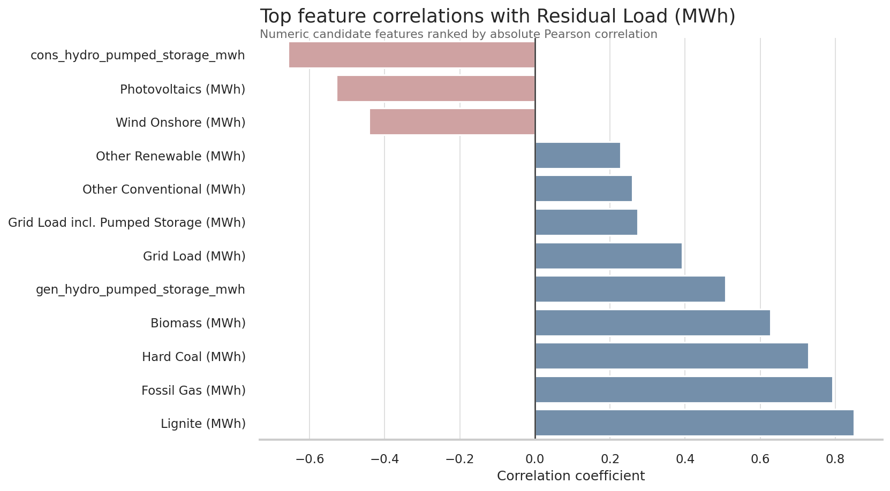

# Probabilistic Energy Forecasting ML

## Overview

This project aims to build an end-to-end day-ahead probabilistic forecasting system for German residual load using public SMARD data.

Residual load is the portion of electricity demand that remains after accounting for wind and solar generation. It is a practically relevant forecasting target because it reflects the flexibility that still needs to be covered by dispatchable generation, storage, imports, or other balancing resources.

The goal is to predict the next 24 hours of hourly residual load and produce probabilistic forecasts in the form of:

- P10
- P50
- P90

This provides not only an expected forecast, but also an uncertainty range for each forecast hour.

## Project Objective

The objective of this project is to develop a reproducible machine learning pipeline that:

- ingests and preprocesses public SMARD time-series data
- constructs a canonical hourly dataset for residual load
- engineers temporal, lag-based, and rolling-window features
- trains baseline and machine learning forecasting models
- generates day-ahead probabilistic forecasts
- evaluates both forecast accuracy and uncertainty calibration
- supports lightweight next-day forecast generation

## Why This Project Matters

From a business and energy-systems perspective, residual load forecasting is useful because it helps estimate how much electricity demand still needs to be covered after variable renewable generation is considered.

This makes the output relevant for:

- flexibility planning
- balancing preparation
- market-oriented analysis
- more efficient integration of renewable energy into the grid

## Forecasting Target

The target variable in this project is **residual load**, defined conceptually as:

**Residual Load = Electricity Demand - Wind Generation - Solar Generation**

The forecast horizon is **day-ahead**, meaning the system predicts the next **24 hourly values**.

## Key Visual Insights

### 1) Residual Load Trend
**Why this matters:** Lower residual load is better because it means more demand is already covered by wind and solar, reducing flexibility pressure on dispatchable resources.

**Observation:** The hourly series is noisy, but the weekly trend line highlights sustained lower-residual periods. This supports using smoothed temporal features in the forecasting pipeline.

### 2) Monthly Residual Share of Grid Load

**Why this matters:** Residual share is a direct KPI for renewable integration quality. Lower share is better.

**Observation:** The best month in this dataset is **June 2025** at **40%** residual share (below 50%). Versus the same month in 2024 (**55%**), that is a **-15 percentage-point improvement**. Also, **February 2026** improved to **57%** versus **68.79%** in **February 2025** (**-11 pp YoY**).

### 3) Top Correlations With Residual Load

**Why this matters:** This plot guides feature engineering for probabilistic forecasting.

**Observation:** Conventional generation signals are strongly positively associated with residual load (e.g., `lignite_mwh` correlation **0.85**), while renewable proxies such as `photovoltaics_mwh` (**-0.53**) and `wind_onshore_mwh` (**-0.44**) move inversely, which is directionally consistent with the project target definition.

